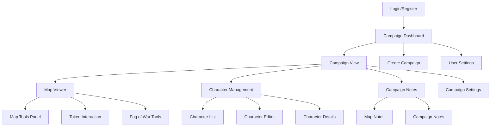
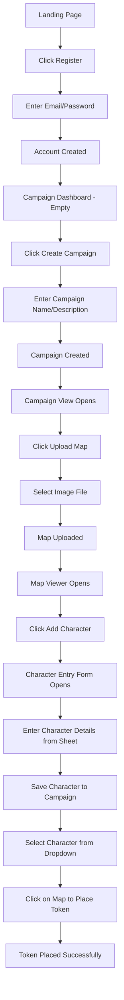
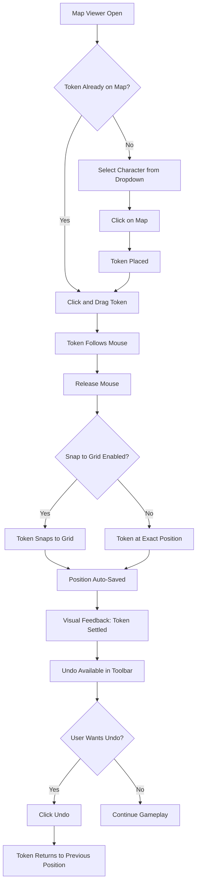
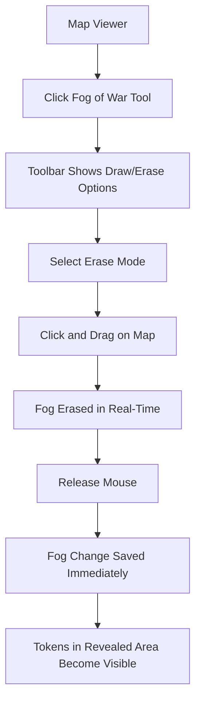
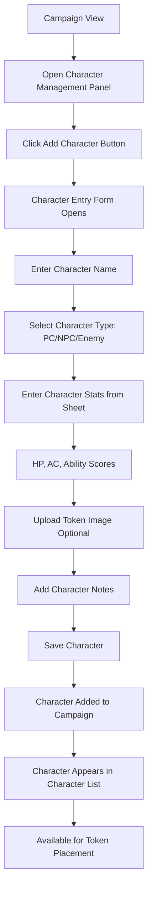

# DnD Interactive Map Application UI/UX Specification

**Version:** 1.0  
**Date:** 2024-12-19  
**Status:** Draft

---

## Introduction

This document defines the user experience goals, information architecture, user flows, and visual design specifications for DnD Interactive Map Application's user interface. It serves as the foundation for visual design and frontend development, ensuring a cohesive and user-centered experience.

The application is a web-based interactive map tool for Dungeons & Dragons game masters, enabling them to manage campaigns, upload maps, place character tokens, and control fog of war. The design must prioritize the map as the focal point while keeping controls accessible and intuitive.

---

## Overall UX Goals & Principles

### Target User Personas

**Primary Persona: The Game Master (DM)**

- **Role:** Dungeon Master running D&D campaigns
- **Technical Comfort:** Moderate to high (comfortable with web apps)
- **Context:** Running sessions, needs quick access to maps and tokens during gameplay
- **Pain Points:** Switching between tools, losing token positions, managing multiple campaigns
- **Goals:** Quick map navigation, easy token placement, persistent campaign data
- **Primary Device:** Desktop (laptop/PC) - primary development target

**Secondary Persona: The Preparatory DM**

- **Role:** DM who prepares sessions in advance
- **Technical Comfort:** Varies
- **Context:** Planning sessions, organizing campaign materials
- **Pain Points:** Organizing maps and notes, setting up encounters
- **Goals:** Easy campaign organization, note-taking, character management

### Usability Goals

1. **Ease of Learning:** New DMs can upload a map and place their first token within 5-7 minutes (realistic onboarding time)
2. **Efficiency of Use:** Experienced DMs can switch maps and move tokens during active gameplay without breaking flow
3. **Error Prevention:** Clear confirmation dialogs for destructive actions (deleting campaigns, maps, characters)
4. **Memorability:** DMs returning after weeks can navigate to their campaign and maps without relearning
5. **Accessibility:** Keyboard navigation for all map interactions; screen reader support for campaign management
6. **Quick Character Access:** Character stats and attributes accessible via hover/click on tokens during movement

### Design Principles

1. **Map-First Design** - The map is the hero. UI elements should never obstruct the map view unnecessarily
2. **Progressive Disclosure** - Show only essential controls; advanced features accessible but not cluttered
3. **Immediate Visual Feedback** - Every action (token move, fog reveal, zoom) provides instant visual response
4. **Consistent Spatial Model** - Tokens maintain positions across sessions; grid system is predictable and reliable
5. **Touch & Mouse Parity** - All interactions work equally well with touch (tablets) and mouse (desktop), with desktop as primary
6. **Contextual Information** - Character stats and details accessible without leaving the map view (hover panels, side panels)

**Key Design Decisions:**

- **Desktop Primary:** Interface optimized for mouse/keyboard with larger screen real estate
- **Character Stats Integration:** Token interactions (hover/click) reveal character information overlay, allowing DMs to reference stats while managing tokens
- **Realistic Onboarding:** 5-7 minute learning curve accounts for account creation, campaign setup, and first map upload

---

## Information Architecture (IA)

### Site Map / Screen Inventory

**Screen Breakdown:**

- **Login/Register:** Authentication entry point
- **Campaign Dashboard:** Overview of all user campaigns
- **Campaign View:** Main workspace with collapsible sidebar navigation
- **Map Viewer:** Full-screen map with fixed top toolbar
- **Character Management:** CRUD operations for characters/NPCs/enemies
- **Notes Panel:** Campaign and map-specific notes

### Navigation Structure

**Primary Navigation (Campaign View):**

- **Top Bar:** Campaign name, user menu, logout
- **Left Sidebar (Collapsible):**
  - Toggle button (hamburger/chevron icon)
  - Maps list (with thumbnails when expanded)
  - Characters/NPCs/Enemies list (filterable when expanded)
  - Campaign Notes
  - Campaign Settings
  - When collapsed: Icon-only mode with tooltips on hover

**Map Viewer Navigation:**

- **Fixed Top Toolbar:**
  - Grid toggle button
  - Fog of War tools (draw/erase toggle)
  - Zoom controls (+/-/reset)
  - Character selector dropdown
  - Map settings icon
  - Sidebar toggle (to access maps/characters list)
- **Character Stats Panel (Right Side):**
  - Slides in from right on token click
  - Shows character name, HP, AC, stats, notes
  - Close button to dismiss
  - Clicking another token updates the panel

**Secondary Navigation:**

- **Breadcrumbs:** Dashboard > Campaign Name > Current Map (when in map viewer)
- **Contextual Panels:**
  - Character stats panel (slides in from right on token click)
  - Map notes panel (collapsible overlay)

**Breadcrumb Strategy:**

- Show full path when in nested views (Map Viewer, Character Editor)
- Hide breadcrumbs in Campaign Dashboard (top-level)
- Clickable breadcrumbs for quick navigation

**Key Navigation Decisions:**

- **Collapsible Sidebar:** Can be hidden during active gameplay to maximize map space; icon-only mode when collapsed
- **Fixed Top Toolbar:** Always visible, doesn't obstruct map view, provides consistent access to map tools
- **Click-Based Character Stats:** Token click opens character stats panel; prevents accidental reveals during token movement

---

## User Flows

### User Flow: First-Time User Onboarding

**User Goal:** Create account, set up first campaign, upload a map, and add first character to campaign

**Entry Points:** Landing page, login screen

**Success Criteria:** User has an active campaign with one map and one character added to the campaign

**Flow Diagram:**

**Edge Cases & Error Handling:**

- Invalid email format → Show inline validation error
- Weak password → Show password requirements
- File upload fails → Show error message with retry option
- Image too large → Show file size limit message
- Network error during save → Show connection status, auto-retry
- Character data entry incomplete → Highlight required fields, prevent save

**Notes:**

- Character management is about adding existing character sheets to the campaign, not creating characters from scratch
- DMs receive character sheets from players and enter the data into the system
- This flow should be completable in 5-7 minutes
- Consider adding a brief tutorial tooltip overlay for first-time users

---

### User Flow: Active Gameplay - Moving Tokens

**User Goal:** Move character tokens on map during active D&D session

**Entry Points:** Map viewer with existing tokens

**Success Criteria:** Token moved to new position, position saved automatically, undo available if needed

**Flow Diagram:**

**Edge Cases & Error Handling:**

- Token dragged off map → Constrain to map boundaries
- Multiple tokens overlap → Show z-index stacking, allow reordering
- Network disconnection → Queue position updates, sync when reconnected
- Token click during drag → Cancel drag, open character stats panel
- Undo stack limit → Store last 10-20 moves, show indicator when limit reached

**Notes:**

- Movement should feel smooth (60fps)
- Grid snapping should be visually obvious
- Auto-save should be silent (no confirmation dialogs)
- Undo/redo feature included for gameplay flexibility - allows quick corrections during active sessions
- Undo stack should be per-session (not persisted across page reloads)

---

### User Flow: Managing Fog of War

**User Goal:** Reveal hidden areas of map by erasing fog of war

**Entry Points:** Map viewer with fog of war enabled

**Success Criteria:** Fog erased, area revealed, change persisted immediately

**Flow Diagram:**

**Edge Cases & Error Handling:**

- Drawing fog over existing tokens → Tokens become hidden
- Erasing large areas → Show progress indicator for save operation
- Rapid fog changes → Batch save operations to prevent performance issues

**Notes:**

- Fog drawing should feel responsive and immediate
- Changes commit immediately (no preview mode needed)
- Consider brush size options for different reveal areas
- Real-time erase provides immediate feedback for active gameplay

---

### User Flow: Adding Character to Campaign

**User Goal:** Add a player's character to the campaign using their character sheet

**Entry Points:** Campaign view, character management panel

**Success Criteria:** Character added with all relevant stats and information, available for token placement

**Flow Diagram:**

**Edge Cases & Error Handling:**

- Missing required fields → Highlight and prevent save
- Invalid stat values → Show validation (e.g., AC range, HP positive)
- Duplicate character name → Warn but allow (characters can have same name)
- Token image upload fails → Use default token icon, allow retry

**Notes:**

- Character entry is data entry from existing character sheets, not character creation
- Form should be efficient for quick data entry
- Consider character templates for common NPC types (future enhancement)
- Token image is optional - system can provide default icons

---

**Key Flow Decisions:**

- **Undo/Redo for Token Movement:** Included for gameplay flexibility - allows quick corrections during active sessions without breaking flow
- **No Preview Mode for Fog:** Changes commit immediately for responsive gameplay experience
- **Character Management:** Focused on adding existing character data to campaigns, not character creation from scratch
